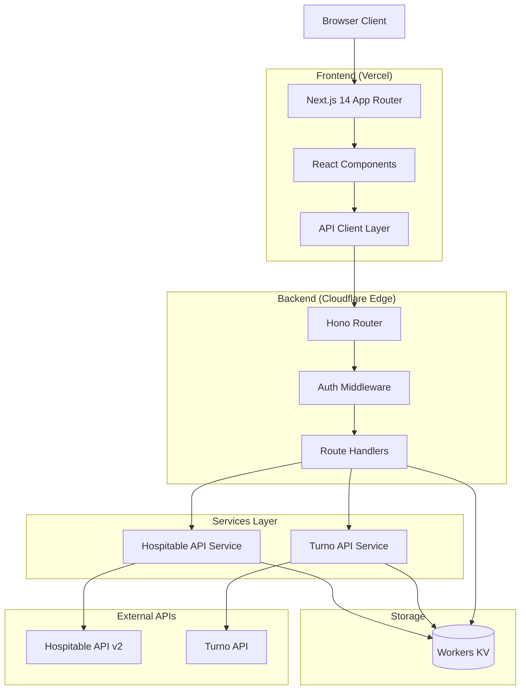

# Architecture: System Overview (Co.Property Dashboard)

This document defines the high-level architecture and design principles for the Co.Property Operations Dashboard, a serverless property management system for short-term rental operations.

## Architecture Overview

The system follows an **edge-first serverless architecture** with:
- **Frontend**: Next.js 14 (Vercel) for SSR and client-side interactivity
- **Backend**: Cloudflare Workers for API handling at the edge
- **Data Sources**: Hospitable and Turno APIs (no local database)
- **Caching**: Workers KV for response caching and task storage



## Architectural Layers

### Frontend Layer (Next.js on Vercel)
**Purpose**: Render UI, handle user interactions, manage client state
**Components**: 
- App Router with file-based routing
- Server Components for initial data fetching
- Client Components for interactivity
- API client for Workers communication
- Zustand for UI state, React Query for server state

### API Layer (Cloudflare Workers)
**Purpose**: Handle API requests, authenticate, route to handlers
**Components**:
- Hono router for HTTP handling
- API key authentication middleware
- Request handlers per resource type
- CORS handling

### Service Layer
**Purpose**: Communicate with external APIs, handle caching logic
**Components**:
- Hospitable API service (properties, reservations)
- Turno API service (cleaning jobs)
- KV-based caching with TTL

### Storage Layer (Workers KV)
**Purpose**: Cache API responses.Store tasks, manage state
**Components**:
- CACHE namespace for API response caching
- TASKS namespace for task storage

## Core Design Principles

### 1. Edge-First
All API requests are handled at Cloudflare's edge network, minimizing latency for users globally.

### 2. Stateless Backend
Workers are stateless - all persistent state lives in external APIs or Workers KV. This enables:
- Automatic horizontal scaling
- Zero cold starts
- Global distribution

### 3. On-Demand Data
Data is fetched from Hospitable/Turno when needed rather than synced to a local database:
- Always fresh data from source of truth
- No sync complexity or data staleness
- Caching mitigates API rate limits

### 4. Simple Authentication
API key authentication for internal operational dashboard:
- Single shared key per deployment
- Stored in localStorage on frontend
- Validated via header on each request

## Data Flow Patterns

### Read Flow (Properties/Reservations)
```
Frontend Request
    ↓
Workers API (check KV cache)
    ↓ (cache miss)
Hospitable/Turno API
    ↓
Store in KV Cache (with TTL)
    ↓
Return to Frontend
```

### Write Flow (Tasks)
```
Frontend Mutation
    ↓
Workers API (validate)
    ↓
Workers KV (store/update)
    ↓
Return confirmation
```

## Caching Strategy

| Resource | TTL | Rationale |
|----------|-----|-----------|
| Properties list | 5 minutes | Rarely changes |
| Single property | 5 minutes | Rarely changes |
| Reservations | 2 minutes | May change frequently |
| Cleaning jobs | 1 minute | Active operations |
| Dashboard stats | 1 minute | Real-time overview |

## Decision History & Trade-offs

### No Persistent Database
**Decision**: Use Hospitable/Turno as source of truth, no local PostgreSQL
**Rationale**:
- Eliminates sync complexity
- Always fresh data
- Reduces infrastructure costs and maintenance
- External APIs already handle data integrity

**Trade-offs**:
- Dependent on external API availability
- Rate limits require caching strategies
- Complex queries must be done client-side
- Cannot store data not in external APIs (solved by KV for tasks)

### API Key vs JWT Authentication
**Decision**: Simple API key authentication instead of JWT
**Rationale**:
- Internal operational dashboard, not public API
- Simpler implementation
- No need for user sessions or tokens
- Quick to implement

**Trade-offs**:
- No per-user authorization
- Key rotation requires coordination
- Less secure for public-facing apps

### Workers KV for Tasks
**Decision**: Store tasks in Workers KV instead of external API
**Rationale**:
- Tasks are internal workflow, not in Hospitable/Turno
- KV provides simple key-value storage
- Edge-native, fast access
- No additional infrastructure needed

**Trade-offs**:
- 25MB value size limit
- Eventually consistent (not immediately consistent)
- Limited query capabilities
- No relational features

---

## Related Documentation

| Document | Relationship |
|----------|--------------|
| [../env.md](../env.md) | Environment variables |
| [../dependencies.md](../dependencies.md) | Approved packages |
| [../api/endpoints.md](../api/endpoints.md) | API routes |
| [../hospitable_api_documentation.md](../hospitable_api_documentation.md) | External API reference |