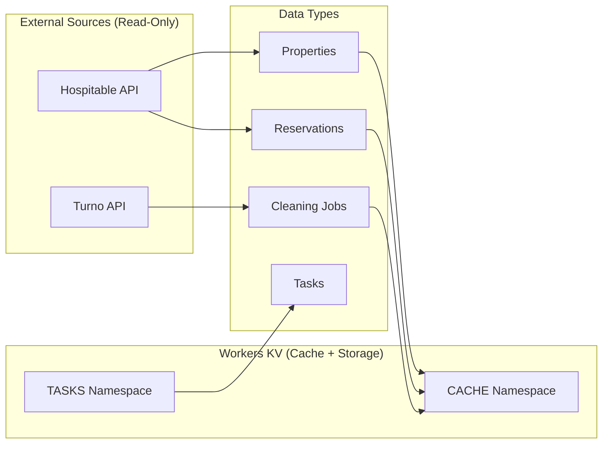

# Data: External API Schema (Co.Property Dashboard)

This document defines the data schema for the Co.Property Operations Dashboard. Since this project uses **external APIs as the source of truth** (Hospitable and Turno) with **Workers KV for caching**, there is no traditional PostgreSQL database.

## Data Architecture Overview



## Data Models (TypeScript)

### Property

Source: Hospitable API `/properties`

```typescript
interface Property {
  id: string           // Internal ID (mapped from hospitable_id)
  hospitable_id: string  // Original Hospitable ID
  name: string         // Property display name
  internal_code: string // Internal reference code
  address: string      // Full address
  building_name?: string
  room_number?: string
  bedrooms: number
  bathrooms: number
  max_guests: number
  check_in_time: string  // "15:00"
  check_out_time: string // "11:00"
  status: 'active' | 'inactive'
  segment?: string      // Property category
}
```

### Reservation

Source: Hospitable API `/reservations`

```typescript
interface Reservation {
  id: string
  property_id: string
  hospitable_id: string
  confirmation_code: string
  platform: 'airbnb' | 'booking' | 'direct' | string
  check_in_date: string   // ISO date "2026-01-15"
  check_out_date: string
  guest_name: string
  guest_email?: string
  guest_phone?: string
  guest_count: number
  total_price: number
  payout_amount: number
  currency: string        // "THB"
  status: 'confirmed' | 'cancelled' | 'pending' | string
  special_requests?: string
  internal_notes?: string
}
```

### Cleaning Job

Source: Turno API `/jobs`

```typescript
interface CleaningJob {
  id: string
  turno_id: string
  property_id: string
  reservation_id?: string
  next_reservation_id?: string
  scheduled_date: string    // ISO date
  scheduled_time?: string   // "10:00"
  deadline_time?: string    // "14:00"
  cleaner_name?: string
  cleaner_phone?: string
  status: 'pending' | 'in_progress' | 'completed' | 'verified'
  started_at?: string       // ISO timestamp
  completed_at?: string
  verified_at?: string
  checklist_completed?: boolean
  photo_count?: number
  issues_reported?: string[]
}
```

### Task

Source: Workers KV `/TASKS` namespace

```typescript
interface Task {
  id: string              // UUID generated on creation
  property_id?: string    // Optional property association
  reservation_id?: string // Optional reservation association
  title: string
  description?: string
  category: 'maintenance' | 'inspection' | 'inventory' | 'general'
  priority: 'low' | 'medium' | 'high' | 'urgent'
  status: 'pending' | 'in_progress' | 'completed'
  assigned_to?: string
  due_date?: string       // ISO date
  completed_at?: string
  created_by: string
  created_at: string      // ISO timestamp
  updated_at: string
}
```

### Dashboard Stats

Aggregated from multiple sources:

```typescript
interface DashboardStats {
  activeReservations: number  // Count from reservations API
  pendingCleaning: number     // Count from cleaning jobs
  taskIssues: number          // High/urgent tasks from KV
  totalProperties: number     // Count from properties API
}
```

## Workers KV Structure

### CACHE Namespace

Key-value pairs for caching API responses:

| Key Pattern | Value Type | TTL | Description |
|-------------|------------|-----|-------------|
| `properties:list` | Property[] | 5 min | All properties |
| `properties:{id}` | Property | 5 min | Single property |
| `reservations:list:{params}` | Reservation[] | 2 min | Filtered reservations |
| `cleaning:list:{date}` | CleaningJob[] | 1 min | Today's cleaning jobs |
| `dashboard:stats` | DashboardStats | 1 min | Aggregated stats |

### TASKS Namespace

Persistent storage for tasks:

| Key Pattern | Value Type | Description |
|-------------|------------|-------------|
| `task:{id}` | Task | Individual task record |
| `tasks:index` | string[] | List of all task IDs |
| `tasks:by_property:{id}` | string[] | Task IDs for property |
| `tasks:by_status:{status}` | string[] | Task IDs by status |

## API Data Transformations

### Hospitable → Property Mapping

```typescript
// Hospitable API response
{
  "id": "hos_12345",
  "name": "Silom Loft 2BR",
  "address": { "street": "123...", "city": "Bangkok" },
  "bedrooms": 2,
  "bathrooms": 1,
  "guests": { "max": 4 }
}

// Transformed Property
{
  id: "12345",
  hospitable_id: "hos_12345", 
  name: "Silom Loft 2BR",
  address: "123..., Bangkok",
  bedrooms: 2,
  bathrooms: 1,
  max_guests: 4,
  status: "active"
}
```

### Turno → CleaningJob Mapping

```typescript
// Turno API response
{
  "job_id": "tur_67890",
  "property_external_id": "12345",
  "date": "2026-01-15",
  "cleaner": { "name": "Somchai", "phone": "+66..." },
  "status": "pending"
}

// Transformed CleaningJob
{
  id: "67890",
  turno_id: "tur_67890",
  property_id: "12345",
  scheduled_date: "2026-01-15",
  cleaner_name: "Somchai",
  cleaner_phone: "+66...",
  status: "pending"
}
```

## Data Validation

Validation happens at the API layer using Zod (or equivalent):

```typescript
import { z } from 'zod'

const CreateTaskSchema = z.object({
  property_id: z.string().uuid().optional(),
  title: z.string().min(1).max(200),
  description: z.string().max(1000).optional(),
  category: z.enum(['maintenance', 'inspection', 'inventory', 'general']),
  priority: z.enum(['low', 'medium', 'high', 'urgent']),
  due_date: z.string().regex(/^\d{4}-\d{2}-\d{2}$/).optional(),
  assigned_to: z.string().optional(),
})
```

## Decision History & Trade-offs

### No Local Database
**Decision**: External APIs are source of truth, no PostgreSQL
**Rationale**: Simplifies architecture, eliminates sync, always fresh data
**Trade-off**: Limited query flexibility, dependent on API availability

### Workers KV for Tasks
**Decision**: Store internal tasks in KV instead of external service
**Rationale**: Simple key-value storage, no additional infrastructure
**Trade-off**: Limited query capabilities, eventual consistency

### Caching with TTL
**Decision**: Cache all API responses with resource-specific TTLs
**Rationale**: Reduce API calls, handle rate limits, improve latency
**Trade-off**: Data may be slightly stale (acceptable for operations)

---

**Related**: See [../hospitable_api_documentation.md](../hospitable_api_documentation.md) for external API details.