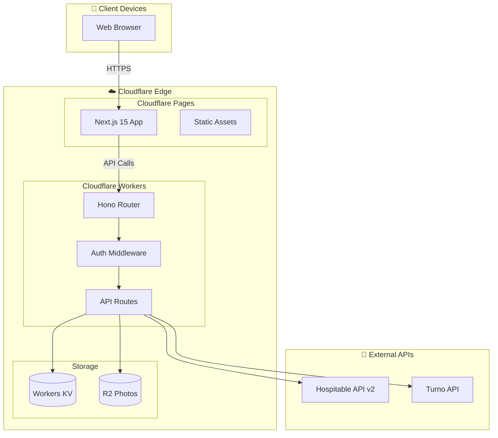
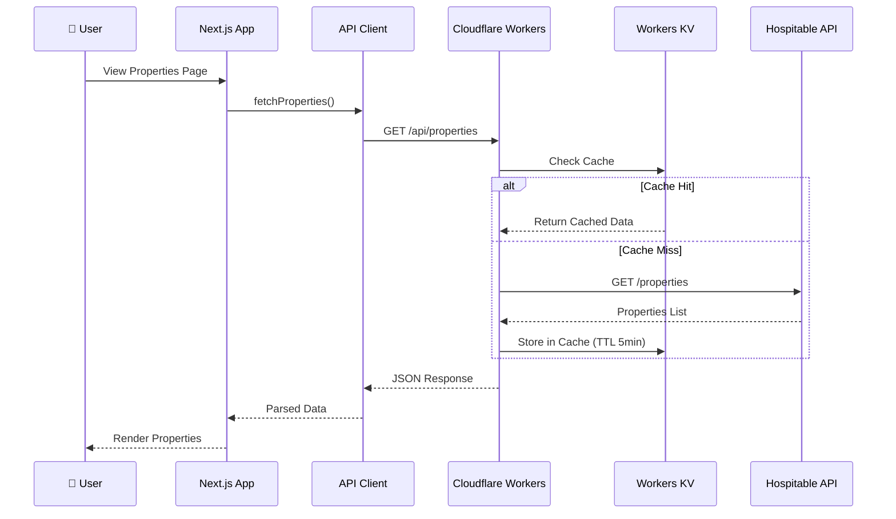
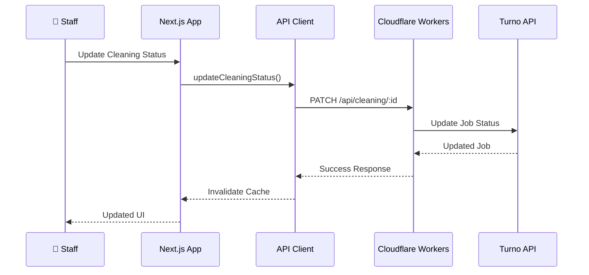
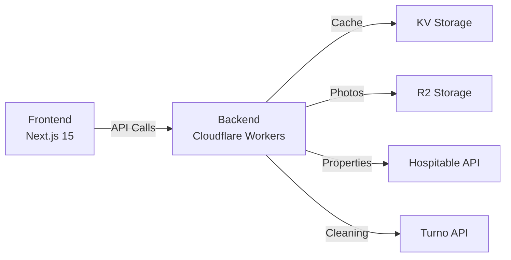

# Co.Property Dashboard

A modern property management dashboard for short-term rental operations. Built with Next.js 15, Tailwind CSS, and Cloudflare Workers.

[](https://co-property-dashboard.pages.dev)
[](https://co-property-api.sheshnarayan-iyer.workers.dev)

---

## Quick Links

| Resource | Link |
|----------|------|
| 🌐 Production Dashboard | https://co-property-dashboard.pages.dev |
| 🔌 API Endpoint | https://co-property-api.sheshnarayan-iyer.workers.dev |
| 📊 API Health Check | https://co-property-api.sheshnarayan-iyer.workers.dev/api/health |
| 📚 Deployment Guide | [DEPLOYMENT.md](./DEPLOYMENT.md) |
| ⚙️ Backend README | [workers/README.md](./workers/README.md) |
| 🏗️ Architecture | [ProjectArchitecture.md](./ProjectArchitecture.md) |

---

## System Architecture



---

## Project Structure

```
dashboard-0.1/
├── src/                          # Frontend source code
│   ├── app/                      # Next.js App Router
│   │   ├── (dashboard)/          # Dashboard layout group
│   │   │   ├── page.tsx          # Dashboard home
│   │   │   ├── properties/       # Property management
│   │   │   ├── reservations/     # Reservations view
│   │   │   ├── cleaning/         # Cleaning coordination
│   │   │   └── tasks/            # Task management
│   │   ├── (auth)/               # Auth layout group
│   │   │   └── login/            # Login page
│   │   └── api/                  # Next.js API routes
│   ├── components/               # React components
│   │   ├── ui/                   # UI components (shadcn)
│   │   ├── dashboard/            # Dashboard components
│   │   ├── properties/           # Property components
│   │   ├── cleaning/             # Cleaning components
│   │   └── layout/               # Layout components
│   ├── lib/                      # Utilities & data
│   │   ├── api-client.ts         # Workers API client
│   │   ├── data/                 # Data fetching
│   │   ├── hooks/                # React Query hooks
│   │   └── stores/               # Zustand stores
│   └── styles/                   # Global styles
├── workers/                      # Backend source code
│   ├── src/
│   │   ├── index.ts              # Workers entry
│   │   ├── middleware/           # Auth middleware
│   │   ├── routes/               # API routes
│   │   ├── services/             # External API services
│   │   └── config/               # Configuration
│   └── wrangler.toml             # Workers config
├── public/                       # Static assets
└── docs/                         # Documentation
```

---

## Data Flow

### Property Data Flow



### Cleaning Status Update Flow



---

## Tech Stack

| Layer | Technology | Purpose |
|-------|------------|---------|
| **Framework** | Next.js 15 | React framework with App Router |
| **Language** | TypeScript | Type-safe development |
| **Styling** | Tailwind CSS | Utility-first CSS |
| **Components** | shadcn/ui | Accessible UI components |
| **State** | Zustand | Client state management |
| **Data Fetching** | React Query | Server state & caching |
| **Backend** | Cloudflare Workers | Edge API handlers |
| **Router** | Hono | Lightweight web framework |
| **Caching** | Workers KV | Edge caching |
| **Storage** | R2 | Photo storage |
| **Auth** | API Key | Simple authentication |

---

## Getting Started

### Prerequisites

- Node.js 18+
- npm or bun
- Cloudflare account (for backend)

### Installation

```bash
# Clone repository
git clone <repo-url>
cd dashboard-0.1

# Install dependencies
npm install

# Copy environment variables
cp .env.example .env

# Edit .env with your values
NEXT_PUBLIC_WORKERS_URL=http://localhost:8787
API_KEY=your_api_key
```

### Development

```bash
# Start frontend dev server
npm run dev

# In another terminal, start Workers dev server
cd workers
npm run dev

# Open http://localhost:3000
```

### Build

```bash
# Build for production
npm run build

# Build for Cloudflare Pages
npm run pages:build
```

---

## API Integration

### API Client Usage

```typescript
import { apiClient } from '@/lib/api-client'

// Fetch properties
const properties = await apiClient('/api/properties')

// Create task
const task = await apiClient('/api/tasks', {
  method: 'POST',
  body: { title: 'Clean Room 101', priority: 'high' }
})

// Update cleaning status
await apiClient('/api/cleaning/123', {
  method: 'PATCH',
  body: { status: 'completed' }
})
```

### React Query Hooks

```typescript
import { useProperties } from '@/lib/hooks/use-properties-query'
import { useCleaningJobs } from '@/lib/hooks/use-cleaning-query'

// In component
const { data: properties, isLoading } = useProperties()
const { data: cleaningJobs } = useCleaningJobs({ date: 'today' })
```

---

## Features

### Dashboard
- 📊 Real-time statistics
- 📈 Revenue charts
- 🏠 Occupancy trends
- 📅 Upcoming check-ins
- ⚠️ Priority tasks

### Properties
- 🏢 100+ property management
- 🖼️ Photo galleries
- 📍 Location mapping
- 📋 Property details

### Reservations
- 📅 Calendar view
- 👥 Guest details
- 💰 Revenue tracking
- 📤 Export to CSV

### Cleaning
- 🧹 Turno integration
- 📱 Photo uploads
- ✏️ Issue reporting
- 📊 Status tracking

### Tasks
- ✅ Task creation
- 🏷️ Priority levels
- 👤 Assignment
- 📱 Real-time updates

---

## Deployment

See [DEPLOYMENT.md](./DEPLOYMENT.md) for detailed deployment instructions.

Quick deploy:

```bash
# Deploy Workers API
cd workers
wrangler deploy

# Deploy Frontend
cd ..
npm run build
npm run pages:build
wrangler pages deploy .vercel/output/static --project-name=co-property-dashboard
```

---

## Environment Variables

| Variable | Description | Required |
|----------|-------------|----------|
| `NEXT_PUBLIC_WORKERS_URL` | Workers API URL | Yes |
| `API_KEY` | API authentication key | Yes |
| `HOSPITABLE_API_TOKEN` | Hospitable API token | Backend |
| `TURNO_TOKEN_ID` | Turno API token ID | Backend |
| `TURNO_SECRET_KEY` | Turno API secret | Backend |

---

## Contributing

1. Create a feature branch
2. Make your changes
3. Run tests: `npm test`
4. Submit a pull request

---

## Documentation

| Document | Description |
|----------|-------------|
| [📐 Architecture](./ProjectArchitecture.md) | System architecture and design decisions |
| [🚀 Deployment](./DEPLOYMENT.md) | Production deployment guide |
| [⚙️ Backend API](./workers/README.md) | Workers API reference and endpoints |
| [🔗 System Integration](./docs/SYSTEM_INTEGRATION.md) | Detailed flowcharts and integration patterns |
| [🎨 Components](./COMPONENT-ENHANCEMENTS.md) | UI component library guide |
| [✅ Test Report](./TEST_REPORT.md) | Testing coverage and results |

### Quick Reference



**Frontend Stack:**
- Next.js 15 (App Router)
- TypeScript
- Tailwind CSS + shadcn/ui
- React Query + Zustand

**Backend Stack:**
- Cloudflare Workers
- Hono Router
- Workers KV
- R2 Object Storage

**External APIs:**
- Hospitable API v2 (Properties & Reservations)
- Turno API (Cleaning Jobs)

---

## License

Private - Co.Property Operations
