# Co.Property Documentation

Welcome to the Co.Property Dashboard documentation. This directory contains comprehensive guides, architecture documents, and integration patterns.

---

## 📚 Documentation Index

### Getting Started

| Document | Description | Audience |
|----------|-------------|----------|
| [../README.md](../README.md) | Main project README with quick start | Everyone |
| [../DEPLOYMENT.md](../DEPLOYMENT.md) | Production deployment guide | Developers, DevOps |

### System Architecture

| Document | Description | Audience |
|----------|-------------|----------|
| [../ProjectArchitecture.md](../ProjectArchitecture.md) | High-level system architecture | Architects, Developers |
| [SYSTEM_INTEGRATION.md](./SYSTEM_INTEGRATION.md) | Detailed integration flowcharts | Frontend Developers |
| [../workers/README.md](../workers/README.md) | Backend API documentation | Backend Developers |

### Development Guides

| Document | Description | Audience |
|----------|-------------|----------|
| [../COMPONENT-ENHANCEMENTS.md](../COMPONENT-ENHANCEMENTS.md) | UI component patterns | Frontend Developers |
| [../TEST_REPORT.md](../TEST_REPORT.md) | Testing documentation | QA, Developers |

---

## 🏗️ System Overview

```mermaid
flowchart TB
    subgraph Documentation["📖 Documentation Structure"]
        Readme[README.md
    Quick Start]
        Arch[ProjectArchitecture.md
    System Design]
        Deploy[DEPLOYMENT.md
    Deployment Guide]
        Integration[SYSTEM_INTEGRATION.md
    Integration Patterns]
        Backend[workers/README.md
    API Reference]
        Components[COMPONENT-ENHANCEMENTS.md
    UI Guide]
    end

    subgraph System["⚙️ System Components"]
        Frontend[Next.js Frontend]
        Workers[Cloudflare Workers]
        Storage[(KV & R2)]
        External[Hospitable & Turno]
    end

    Readme -.-> Frontend
    Arch -.-> System
    Deploy -.-> System
    Integration -.-> Frontend
    Integration -.-> Workers
    Backend -.-> Workers
    Components -.-> Frontend
```

---

## 🎯 Choose Your Path

### I'm a Frontend Developer

Start here:
1. [../README.md](../README.md) - Project overview
2. [SYSTEM_INTEGRATION.md](./SYSTEM_INTEGRATION.md) - Learn data flow patterns
3. [../COMPONENT-ENHANCEMENTS.md](../COMPONENT-ENHANCEMENTS.md) - UI components
4. [../workers/README.md](../workers/README.md) - Understand the API

Key sections:
- [Server Components Pattern](./SYSTEM_INTEGRATION.md#pattern-1-server-side-fetching-properties-page)
- [Client Components Pattern](./SYSTEM_INTEGRATION.md#pattern-2-client-side-fetching-real-time-updates)
- [Mutation with Optimistic Updates](./SYSTEM_INTEGRATION.md#pattern-3-mutation-with-optimistic-updates)

### I'm a Backend Developer

Start here:
1. [../workers/README.md](../workers/README.md) - API documentation
2. [SYSTEM_INTEGRATION.md](./SYSTEM_INTEGRATION.md) - Integration patterns
3. [../ProjectArchitecture.md](../ProjectArchitecture.md) - System design

Key sections:
- [API Endpoints](../workers/README.md#api-endpoints)
- [Caching Strategy](../workers/README.md#caching-strategy)
- [Data Flow Diagrams](../workers/README.md#data-flow-diagrams)

### I'm DevOps

Start here:
1. [../DEPLOYMENT.md](../DEPLOYMENT.md) - Deployment guide
2. [../ProjectArchitecture.md](../ProjectArchitecture.md) - Infrastructure
3. [../workers/README.md](../workers/README.md) - Backend config

Key sections:
- [Deployment Steps](../DEPLOYMENT.md#deployment-steps)
- [Configuration Files](../DEPLOYMENT.md#configuration-files)
- [Troubleshooting](../DEPLOYMENT.md#troubleshooting)

### I'm a New Team Member

Start here:
1. [../README.md](../README.md) - Project overview
2. [../ProjectArchitecture.md](../ProjectArchitecture.md) - Architecture
3. [SYSTEM_INTEGRATION.md](./SYSTEM_INTEGRATION.md) - How it all connects

---

## 🔗 Quick Links

### Production URLs
- **Dashboard**: https://co-property-dashboard.pages.dev
- **API**: https://co-property-api.sheshnarayan-iyer.workers.dev
- **Health Check**: https://co-property-api.sheshnarayan-iyer.workers.dev/api/health

### Repositories
- Frontend: `/src`
- Backend: `/workers`
- Docs: `/docs`

---

## 📊 Architecture Diagrams

### Request Flow

### Data Architecture

---

## 📝 Contributing to Documentation

When adding new documentation:

1. Place in appropriate folder (`/docs` for guides, `/workers` for API)
2. Use clear headings and table of contents
3. Include mermaid diagrams for complex flows
4. Link to related documents
5. Update this index

### Documentation Standards

- **README files**: Quick start and overview
- **SYSTEM_INTEGRATION.md**: Detailed flowcharts and patterns
- **DEPLOYMENT.md**: Step-by-step deployment instructions
- **Architecture docs**: System design and decisions

---

*Last Updated: February 2026*
