# Co.Property System Integration Guide

Complete system documentation with detailed flowcharts showing frontend-backend integration patterns.

---

## Table of Contents

1. [System Overview](#system-overview)
2. [Request Lifecycle](#request-lifecycle)
3. [Data Flow Patterns](#data-flow-patterns)
4. [Component Integration](#component-integration)
5. [Error Handling Flows](#error-handling-flows)
6. [Authentication Flow](#authentication-flow)

---

## System Overview

### Full System Architecture

```mermaid
flowchart TB
    subgraph Browser["🌐 Browser"]
        React[React Components]
        Query[React Query]
        Zustand[Zustand Store]
    end

    subgraph NextApp["⚛️ Next.js App"]
        Router[App Router]
        
        subgraph Server["Server Components"]
            SProps[fetchProperties]
            SRes[fetchReservations]
            SDash[fetchDashboardStats]
        end
        
        subgraph Client["Client Components"]
            CProps[useProperties]
            CRes[useReservations]
            CClean[useCleaningJobs]
        end
        
        APIClient[API Client]
    end

    subgraph Edge["☁️ Cloudflare Edge"]
        Worker[Worker]
        
        subgraph WorkerRoutes["Routes"]
            RProps[/api/properties]
            RRes[/api/reservations]
            RClean[/api/cleaning]
            RDash[/api/dashboard/*]
        end
        
        Auth[Auth Middleware]
        Cache[Cache Layer]
    end

    subgraph Storage["💾 Storage"]
        KV[(Workers KV)]
        R2[(R2 Photos)]
    end

    subgraph External["🔗 External APIs"]
        Hospitable[Hospitable API]
        Turno[Turno API]
    end

    React --> Query
    Query --> Zustand
    
    Router --> Server
    Router --> Client
    
    Server --> APIClient
    Client --> APIClient
    
    APIClient -->|HTTPS + Auth| Worker
    Worker --> Auth
    Auth --> WorkerRoutes
    
    RProps --> Cache
    RRes --> Cache
    RClean --> Cache
    RDash --> Cache
    
    Cache --> KV
    
    RProps -->|Cache Miss| Hospitable
    RRes -->|Cache Miss| Hospitable
    RClean -->|Cache Miss| Turno
    
    RClean --> R2
```

---

## Request Lifecycle

### 1. Dashboard Page Load

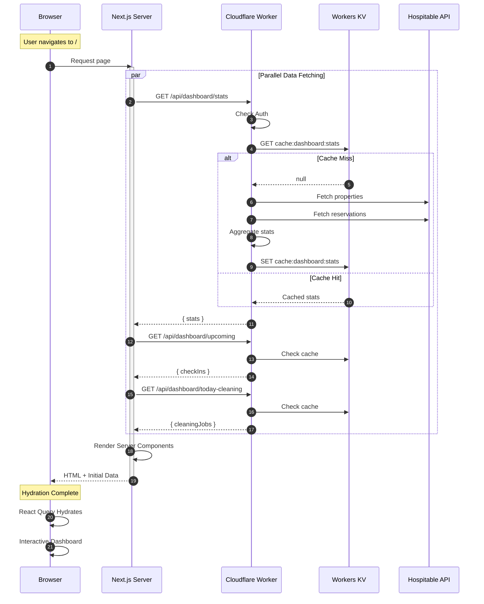

### 2. User Interaction Flow

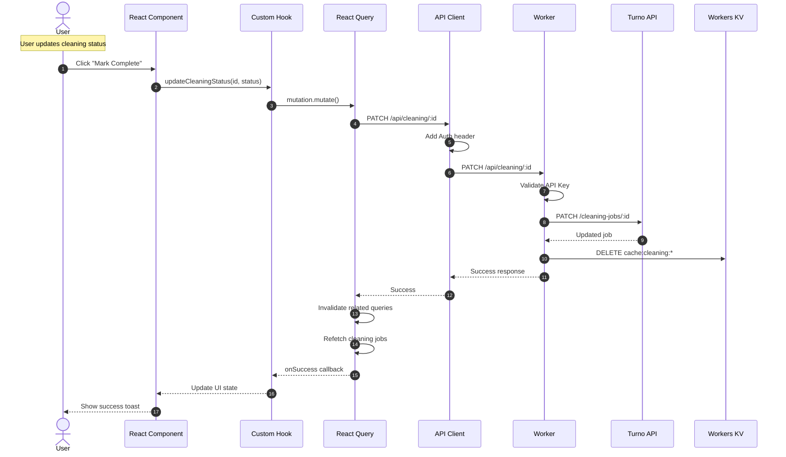

---

## Data Flow Patterns

### Pattern 1: Server-Side Fetching (Properties Page)

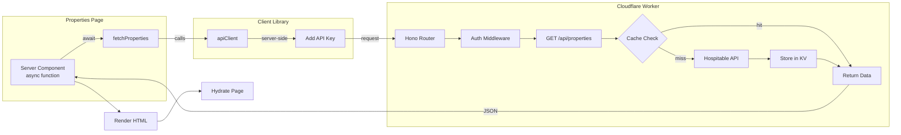

**Code Example:**
```typescript
// Server Component (app/properties/page.tsx)
async function PropertiesPage() {
  // This runs on the server during SSR
  const properties = await fetchProperties()
  
  return (
    <div>
      <PropertyTable data={properties} />
    </div>
  )
}

// Data function (lib/data/properties.ts)
export async function fetchProperties() {
  // Server-side API call with API key from env
  return apiClient('/api/properties')
}

// API Client (lib/api-client.ts)
async function apiClient(endpoint: string) {
  const headers: HeadersInit = {}
  
  // Server-side: use env var
  if (typeof window === 'undefined') {
    headers['Authorization'] = `Bearer ${process.env.API_KEY}`
  }
  
  const response = await fetch(`${WORKERS_URL}${endpoint}`, {
    headers,
    cache: 'no-store'
  })
  
  return response.json()
}
```

### Pattern 2: Client-Side Fetching (Real-time Updates)

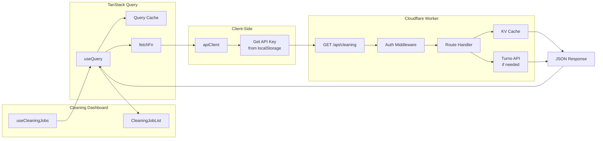

**Code Example:**
```typescript
// Hook (lib/hooks/use-cleaning-query.ts)
export function useCleaningJobs(filters?: CleaningFilters) {
  return useQuery({
    queryKey: ['cleaning', filters],
    queryFn: () => fetchCleaningJobs(filters),
    staleTime: 60000, // 1 minute
  })
}

// Component (components/cleaning/cleaning-dashboard.tsx)
function CleaningDashboard() {
  const { data: jobs, isLoading } = useCleaningJobs({ date: 'today' })
  
  if (isLoading) return <Skeleton />
  
  return <CleaningJobList jobs={jobs} />
}

// Client-side API call
async function fetchCleaningJobs(filters) {
  // Client-side: get key from localStorage
  const apiKey = localStorage.getItem('api_key')
  
  return apiClient('/api/cleaning?' + new URLSearchParams(filters), {
    headers: {
      'Authorization': `Bearer ${apiKey}`
    }
  })
}
```

### Pattern 3: Mutation with Optimistic Updates

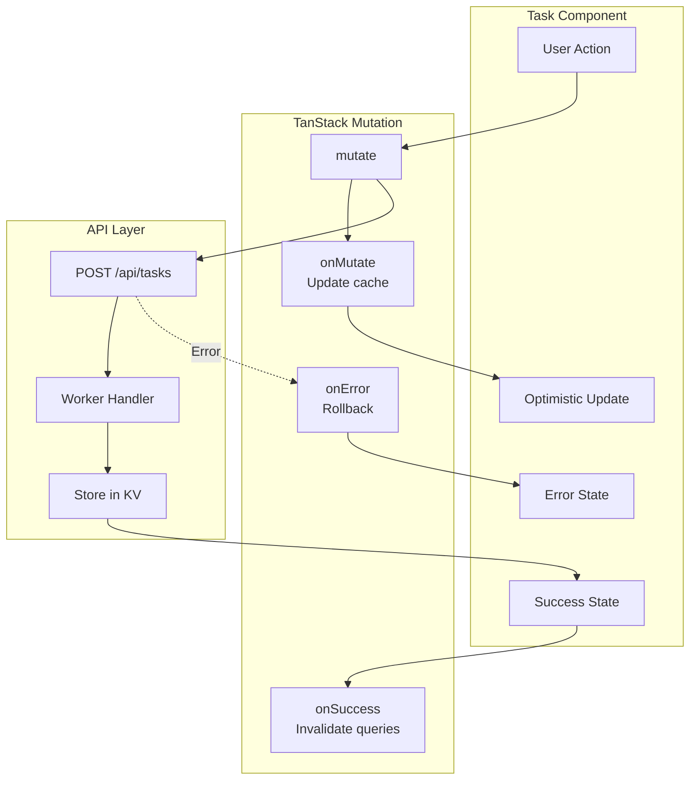

**Code Example:**
```typescript
// Mutation hook
export function useCreateTask() {
  const queryClient = useQueryClient()
  
  return useMutation({
    mutationFn: (task: CreateTaskInput) => 
      apiClient('/api/tasks', { method: 'POST', body: task }),
    
    onMutate: async (newTask) => {
      // Cancel outgoing refetches
      await queryClient.cancelQueries({ queryKey: ['tasks'] })
      
      // Snapshot previous value
      const previousTasks = queryClient.getQueryData(['tasks'])
      
      // Optimistically update
      queryClient.setQueryData(['tasks'], (old) => [...old, newTask])
      
      return { previousTasks }
    },
    
    onError: (err, newTask, context) => {
      // Rollback on error
      queryClient.setQueryData(['tasks'], context?.previousTasks)
    },
    
    onSettled: () => {
      // Refetch to ensure sync
      queryClient.invalidateQueries({ queryKey: ['tasks'] })
    }
  })
}
```

---

## Component Integration

### Property Detail Page Flow

```mermaid
flowchart TB
    subgraph Page["Property Detail Page
    /properties/:id"]
        Server[Server Component]
        Tabs[PropertyDetailTabs
    Client Component]
        Gallery[ImageGallery]
        Info[PropertyInfo]
        Calendar[ReservationCalendar]
    end

    subgraph Data["Data Layer"]
        Server -->|fetch| GetProperty[getProperty id]
        Server -->|fetch| GetReservations[getReservations
    propertyId]
        Tabs -->|client| UseProperty[useProperty]
        Calendar -->|client| UseReservations[useReservations]
    end

    subgraph Worker["Cloudflare Worker"]
        GetProperty -->|GET| API1[/api/properties/:id]
        GetReservations -->|GET| API2[/api/reservations?property_id=]
        UseProperty -->|GET| API1
        UseReservations -->|GET| API2
    end

    subgraph Cache["Caching"]
        API1 --> KV1[(KV: Property)]
        API2 --> KV2[(KV: Reservations)]
    end

    subgraph External["External"]
        API1 -->|miss| Hospitable[Hospitable API]
        API2 -->|miss| Hospitable
    end

    Server --> Tabs
    Tabs --> Gallery
    Tabs --> Info
    Tabs --> Calendar
```

### Dashboard Widget Integration

```mermaid
flowchart LR
    subgraph Dashboard["Dashboard Page"]
        Stats[StatsCards
    Server Component]
        Charts[ChartsSection
    Client Component]
        Activity[RecentActivity
    Server Component]
        Cleaning[CleaningWidget
    Client Component]
    end

    subgraph Parallel["Parallel Fetching"]
        Stats -->|await| StatsAPI[/api/dashboard/stats]
        Activity -->|await| ActivityAPI[/api/dashboard/recent-activity]
        Charts -->|useQuery| RevenueAPI[/api/dashboard/revenue-trends]
        Charts -->|useQuery| OccupancyAPI[/api/dashboard/occupancy-trends]
        Cleaning -->|useQuery| CleaningAPI[/api/dashboard/today-cleaning]
    end

    subgraph Worker["Worker Aggregation"]
        StatsAPI -->|parallel| Multi1[Hospitable + Turno]
        ActivityAPI -->|parallel| Multi2[Hospitable + KV]
        RevenueAPI --> Hospitable1[Hospitable]
        OccupancyAPI --> Hospitable2[Hospitable]
        CleaningAPI --> Turno[Turno API]
    end

    subgraph Response["Response"]
        Multi1 --> StatsData[Stats Data]
        Multi2 --> ActivityData[Activity Data]
        Hospitable1 --> ChartData1[Chart Data]
        Hospitable2 --> ChartData2[Chart Data]
        Turno --> CleaningData[Cleaning Data]
    end
```

---

## Error Handling Flows

### API Error Handling

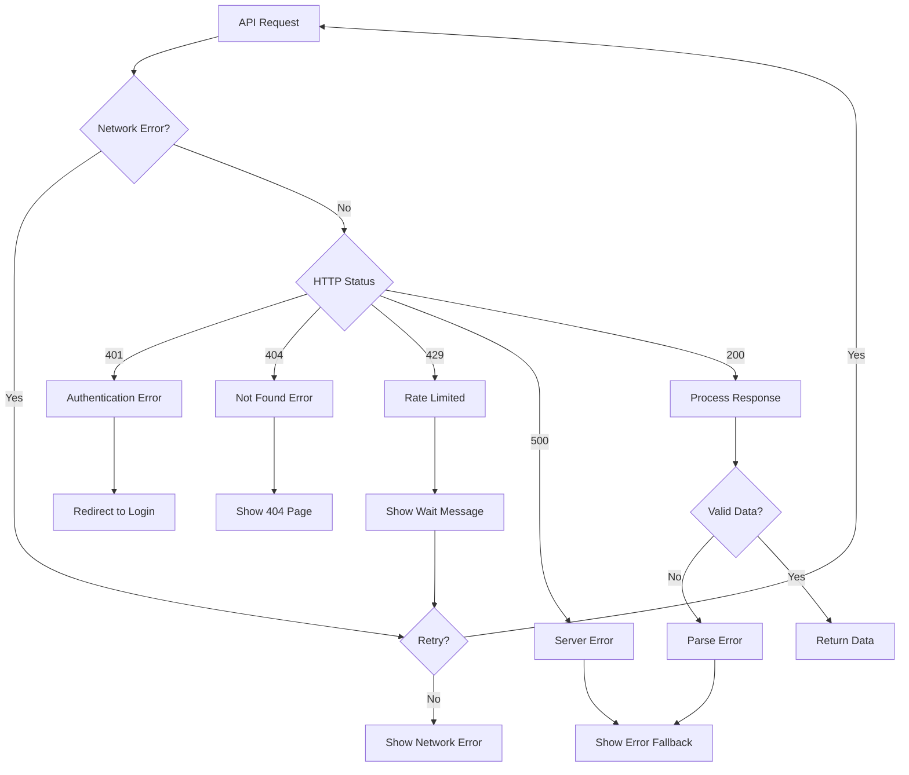

### Error Boundary Flow

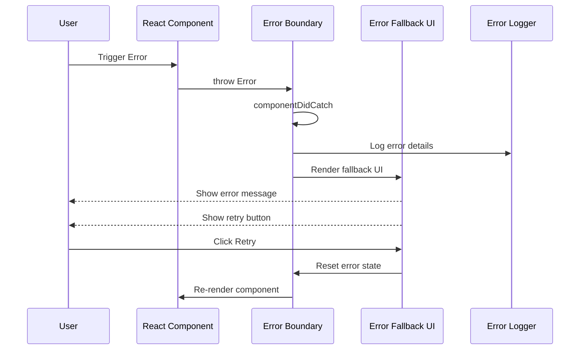

---

## Authentication Flow

### Login Flow

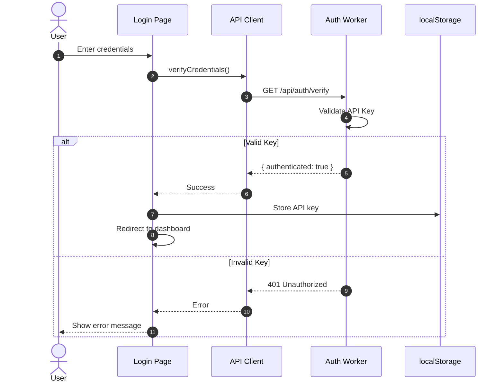

### Authenticated Request Flow

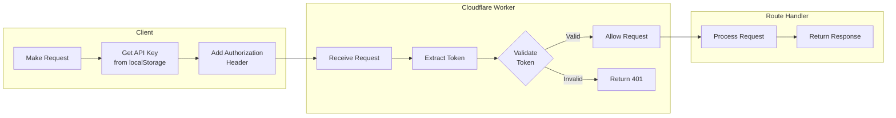

---

## Caching Strategy Diagram

### Multi-Layer Caching

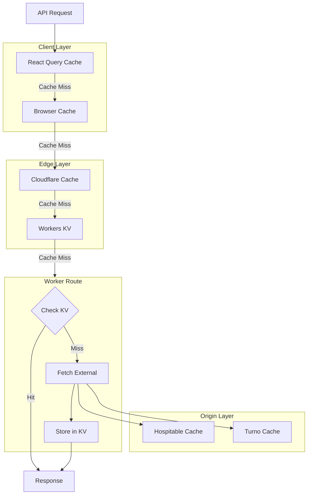

### Cache Invalidation Flow

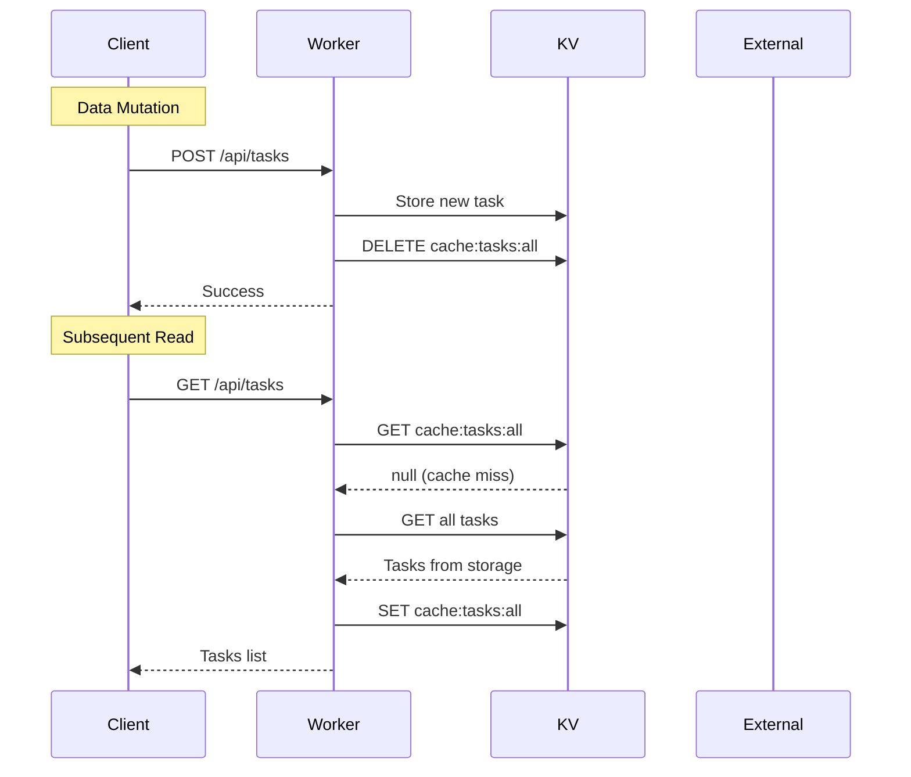

---

## File Structure Integration

### Import Patterns

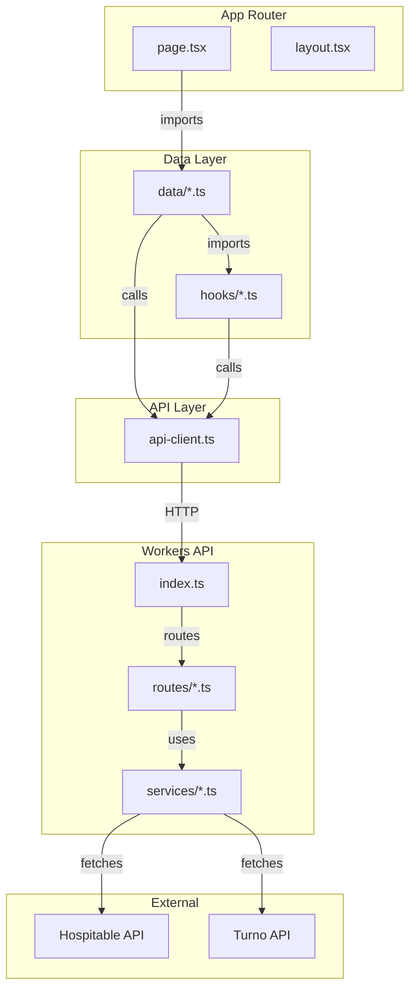

---

## Performance Optimization Flow

### Request Deduplication

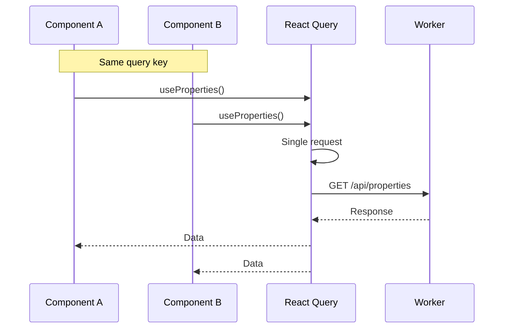

### Prefetching Flow

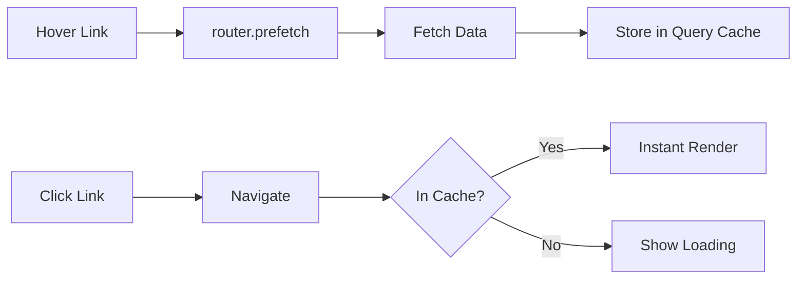

---

## Development Workflow

### Local Development Setup

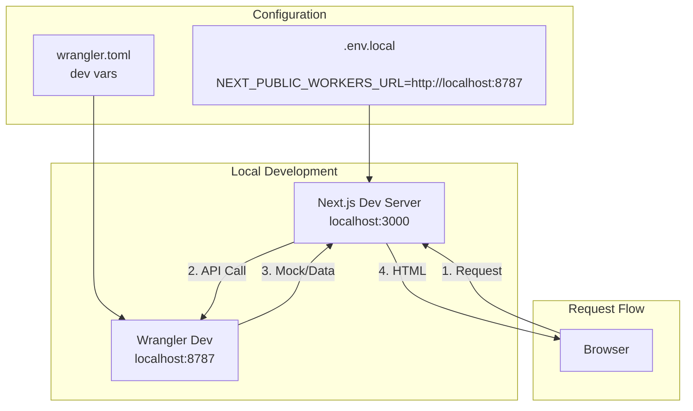

---

## Deployment Flow

### Production Deployment

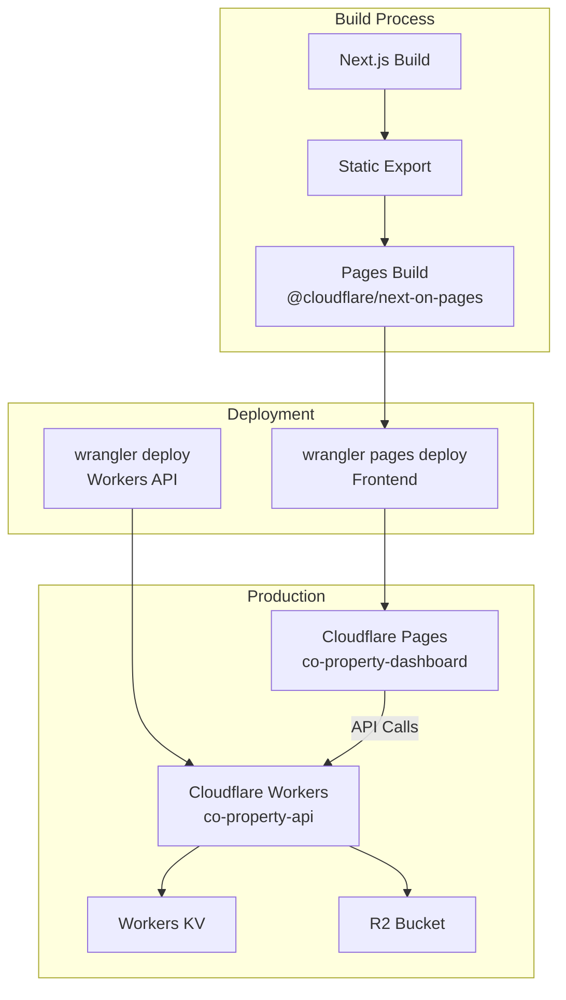

---

*Last Updated: February 2026*
