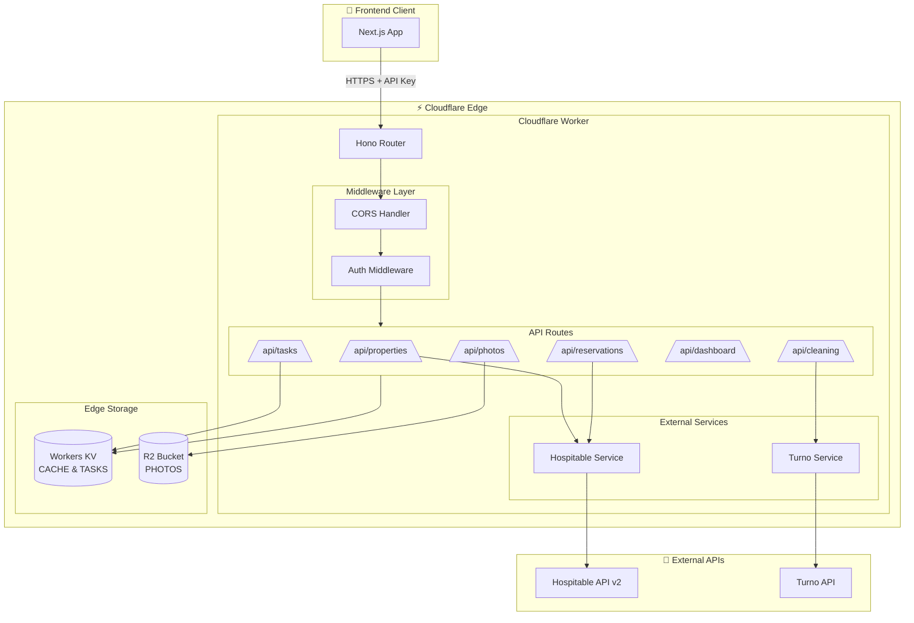
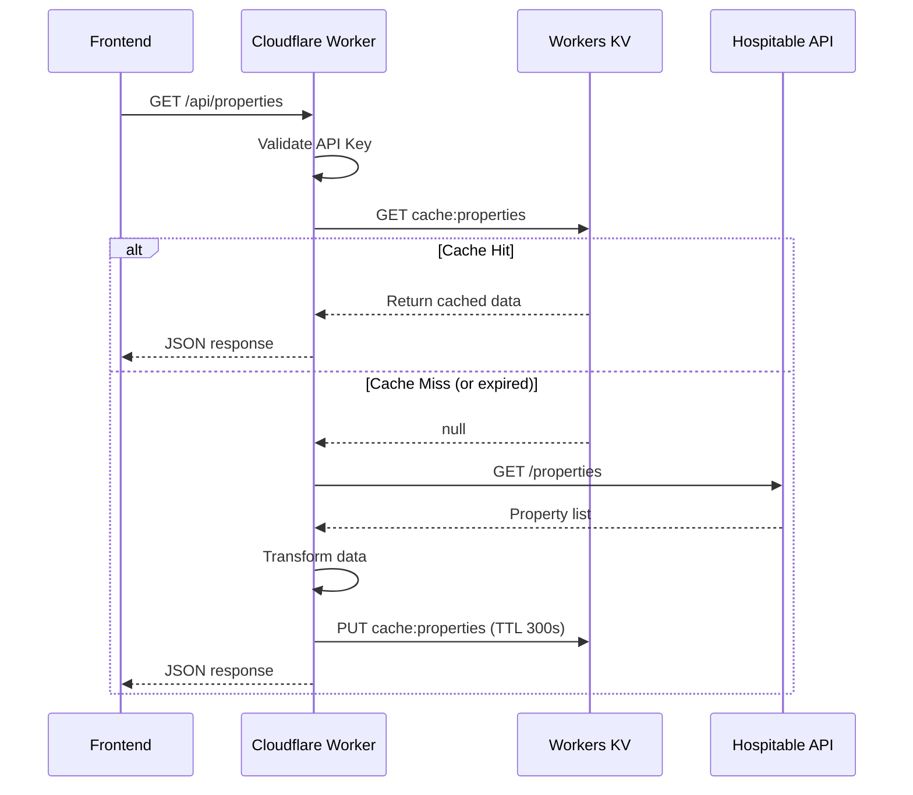
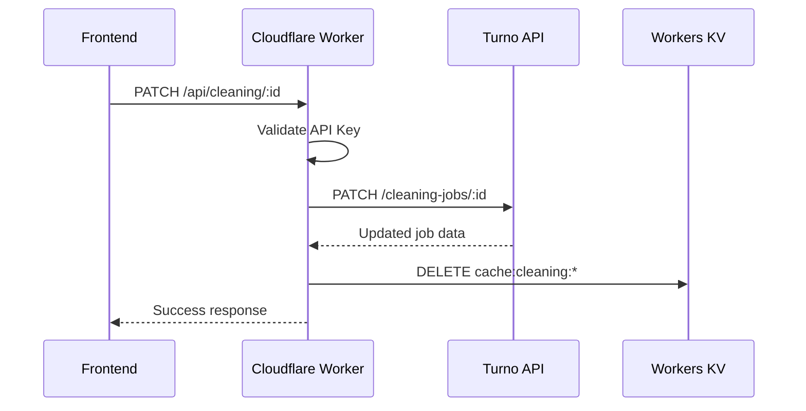
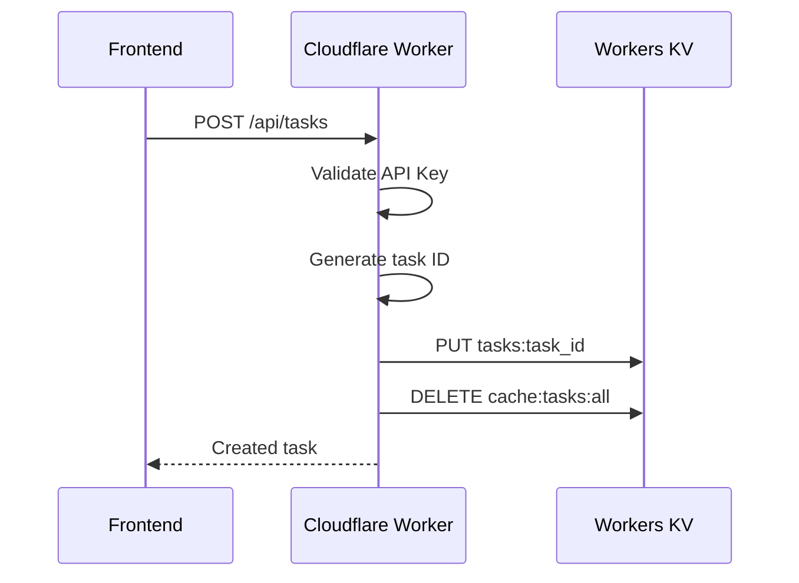
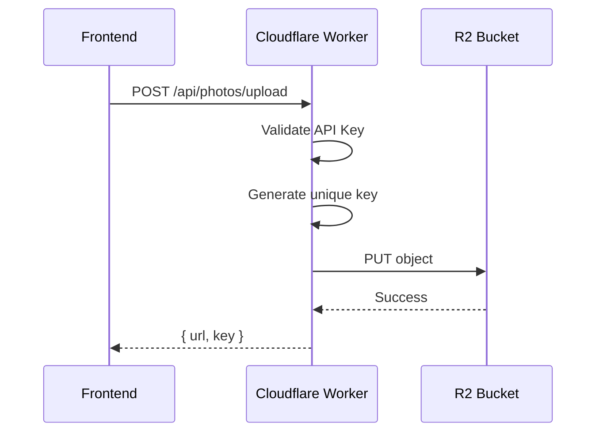

# Co.Property Workers API

Cloudflare Workers backend for the Co.Property Dashboard. Provides edge-based API handlers for property management operations with integrations to Hospitable and Turno APIs.

---

## Quick Links

| Resource | Link |
|----------|------|
| 🌐 Production API | https://co-property-api.sheshnarayan-iyer.workers.dev |
| 🏥 Health Check | https://co-property-api.sheshnarayan-iyer.workers.dev/api/health |
| 📊 Dashboard | https://co-property-dashboard.pages.dev |

---

## Architecture Overview



---

## Project Structure

```
workers/
├── src/
│   ├── index.ts              # Worker entry point
│   ├── middleware/
│   │   └── auth.ts           # API key authentication
│   ├── routes/
│   │   ├── properties.ts     # Property endpoints
│   │   ├── reservations.ts   # Reservation endpoints
│   │   ├── cleaning.ts       # Cleaning job endpoints
│   │   ├── tasks.ts          # Task management endpoints
│   │   ├── dashboard.ts      # Dashboard stats endpoints
│   │   ├── photos.ts         # Photo upload endpoints
│   │   └── analytics.ts      # Web vitals ingestion
│   ├── services/
│   │   ├── hospitable.ts     # Hospitable API client
│   │   └── turno.ts          # Turno API client
│   └── config/
│       └── r2.ts             # R2 configuration
├── wrangler.toml             # Worker configuration
└── package.json
```

---

## API Endpoints

### Authentication

All endpoints (except `/api/health`) require an API key in the Authorization header:

```bash
Authorization: Bearer YOUR_API_KEY
```

### Health Check

```bash
GET /api/health
```

Response:
```json
{
  "status": "ok",
  "timestamp": "2026-01-01T00:00:00.000Z",
  "service": "co-property-api"
}
```

### Properties

```bash
# List all properties
GET /api/properties

# Get single property
GET /api/properties/:id

# Sync properties from Hospitable
POST /api/properties/sync
```

**Response:**
```json
{
  "data": [
    {
      "id": "prop_123",
      "hospitable_id": "h_456",
      "name": "Sunset Villa",
      "internal_code": "SV001",
      "address": "123 Main St, Bangkok",
      "building_name": "Sunset Towers",
      "room_number": "101",
      "bedrooms": 2,
      "bathrooms": 2,
      "max_guests": 4,
      "status": "active",
      "segment": "luxury"
    }
  ]
}
```

### Reservations

```bash
# List reservations
GET /api/reservations

# Query params:
# - status: confirmed, cancelled, pending
# - property_id: filter by property
# - from_date: YYYY-MM-DD
# - to_date: YYYY-MM-DD

# Get single reservation
GET /api/reservations/:id
```

### Cleaning Jobs

```bash
# List cleaning jobs
GET /api/cleaning

# Query params:
# - date: YYYY-MM-DD (default: today)
# - status: pending, in_progress, completed
# - property_id: filter by property

# Get single job
GET /api/cleaning/:id

# Update job status
PATCH /api/cleaning/:id
Body: { "status": "completed", "notes": "All done" }

# Report issue
POST /api/cleaning/:id/issues
Body: { "type": "damaged_item", "description": "...", "photos": [] }

# Upload photos
POST /api/cleaning/:id/photos
Body: FormData with photo files
```

### Tasks

```bash
# List tasks
GET /api/tasks

# Query params:
# - status: pending, in_progress, completed
# - priority: low, medium, high, urgent
# - assigned_to: user_id

# Create task
POST /api/tasks
Body: {
  "title": "Fix AC in Room 101",
  "description": "Air conditioner not cooling",
  "priority": "high",
  "property_id": "prop_123",
  "due_date": "2026-01-15"
}

# Update task
PATCH /api/tasks/:id
Body: { "status": "completed", "completed_at": "2026-01-01T00:00:00Z" }

# Delete task
DELETE /api/tasks/:id
```

### Dashboard Stats

```bash
# Get dashboard statistics
GET /api/dashboard/stats

# Get upcoming check-ins
GET /api/dashboard/upcoming?limit=50

# Get revenue trends
GET /api/dashboard/revenue-trends?days=30

# Get occupancy trends
GET /api/dashboard/occupancy-trends?days=30

# Get booking sources
GET /api/dashboard/booking-sources

# Get property performance
GET /api/dashboard/property-performance?limit=5&period=30

# Get today's cleaning jobs
GET /api/dashboard/today-cleaning

# Get task priority breakdown
GET /api/dashboard/task-priority-breakdown

# Get recent activity
GET /api/dashboard/recent-activity?limit=15
```

### Photos

```bash
# Upload photo to R2
POST /api/photos/upload
Body: FormData with file

# Get photo URL
GET /api/photos/:key
```

---

## Data Flow Diagrams

### Property Fetch Flow



### Cleaning Job Update Flow



### Task Creation Flow



### Photo Upload Flow



---

## Caching Strategy

| Endpoint | Cache Key | TTL | Notes |
|----------|-----------|-----|-------|
| GET /api/properties | `hospitable:/properties` | 5 min | Properties list |
| GET /api/properties/:id | `hospitable:/properties/:id` | 5 min | Single property |
| GET /api/reservations | `hospitable:/reservations` | 2 min | Reservations |
| GET /api/cleaning | `turno:cleaning:*` | 1 min | Cleaning jobs |
| GET /api/dashboard/stats | `dashboard:stats` | 2 min | Aggregated stats |
| GET /api/tasks | `tasks:all` | 0 | No cache (frequent changes) |

Cache invalidation:
- Property sync: Clears `hospitable:/properties`
- Cleaning update: Clears `turno:cleaning:*`
- Task mutation: Clears `tasks:all`

---

## Configuration

### wrangler.toml

```toml
name = "co-property-api"
main = "src/index.ts"
compatibility_date = "2024-01-01"

# KV Namespaces
[[kv_namespaces]]
binding = "CACHE"
id = "your-cache-namespace-id"

[[kv_namespaces]]
binding = "TASKS"
id = "your-tasks-namespace-id"

[vars]
HOSPITABLE_BASE_URL = "https://public.api.hospitable.com/v2"
TURNO_BASE_URL = "https://api.turno.com/v1"
R2_PUBLIC_URL = "https://photos.coproperty.com"

# R2 Buckets
[[r2_buckets]]
binding = "PHOTOS"
bucket_name = "coproperty-photos-dev"
preview_bucket_name = "coproperty-photos-preview"
```

### Secrets

Set via `wrangler secret put`:

- `HOSPITABLE_API_TOKEN` - Hospitable API bearer token
- `TURNO_API_KEY` - Turno API key
- `API_KEY` - Internal API authentication key

---

## Development

### Setup

```bash
cd workers
npm install
```

### Local Development

```bash
# Start dev server
npm run dev

# Server runs at http://localhost:8787
```

### Testing

```bash
# Run tests
npm test

# Run with coverage
npm run test:coverage

# Run in watch mode
npm run test:watch
```

### Deployment

```bash
# Deploy to production
wrangler deploy

# Deploy with env
wrangler deploy --env production
```

---

## Services

### HospitableService

Handles all Hospitable API interactions:

```typescript
const hospitable = new HospitableService(env)

// Get all properties
const properties = await hospitable.getProperties()

// Get single property
const property = await hospitable.getProperty(id)

// Get reservations
const reservations = await hospitable.getReservations({
  status: 'confirmed',
  from_date: '2026-01-01',
  to_date: '2026-01-31'
})
```

### TurnoService

Handles all Turno API interactions:

```typescript
const turno = new TurnoService(env)

// Get cleaning jobs
const jobs = await turno.getCleaningJobs({
  date: '2026-01-15',
  status: 'pending'
})

// Update job status
await turno.updateJobStatus(id, 'completed')

// Report issue
await turno.reportIssue(id, {
  type: 'damaged_item',
  description: '...',
  photos: []
})
```

---

## Error Handling

All errors follow the standard format:

```json
{
  "error": "Error message",
  "code": "ERROR_CODE",
  "details": {}
}
```

HTTP Status Codes:
- `200` - Success
- `201` - Created
- `400` - Bad Request
- `401` - Unauthorized
- `404` - Not Found
- `500` - Internal Server Error
- `502` - External API Error

---

## Rate Limiting

Currently implemented at the Cloudflare level. Future enhancements:
- Per-API-key rate limiting
- Endpoint-specific limits
- Burst handling

---

## Monitoring

### Logs

```bash
# Stream logs
wrangler tail

# Filter logs
wrangler tail --format pretty
```

### Analytics

View in Cloudflare Dashboard:
- Request volume
- Error rates
- Cache hit ratio
- KV operations

---

## Security

1. **API Key Authentication**: All endpoints require valid API key
2. **CORS**: Configured for frontend domain
3. **HTTPS Only**: All traffic encrypted
4. **Secrets**: Stored in encrypted Workers secrets
5. **R2 Privacy**: Photos bucket is private, accessed only via Workers

---

## Performance

### Optimizations

- Edge caching via KV
- Parallel API requests
- Response compression
- Efficient data transformation

### Benchmarks

| Endpoint | Avg Response | Cache Hit |
|----------|--------------|-----------|
| GET /api/properties | ~150ms | ~50ms |
| GET /api/dashboard/stats | ~200ms | ~30ms |
| GET /api/cleaning | ~300ms | ~40ms |

---

## Troubleshooting

### Common Issues

**Error: Missing Authorization header**
- Ensure `Authorization: Bearer YOUR_KEY` header is present

**Error: Hospitable API error**
- Check `HOSPITABLE_API_TOKEN` secret is set correctly

**Error: Cache not working**
- Verify KV namespace binding is correct

**Slow responses**
- Check external API status
- Monitor KV cache hit rate

---

## Related Documentation

| Document | Description |
|----------|-------------|
| [Frontend README](../README.md) | Next.js frontend documentation |
| [System Integration](../docs/SYSTEM_INTEGRATION.md) | Detailed flowcharts and patterns |
| [Deployment Guide](../DEPLOYMENT.md) | Production deployment steps |
| [Architecture](../ProjectArchitecture.md) | System architecture overview |

---

## Contributing

1. Create feature branch
2. Write tests
3. Run `npm test`
4. Submit PR

---

## License

Private - Co.Property Operations
